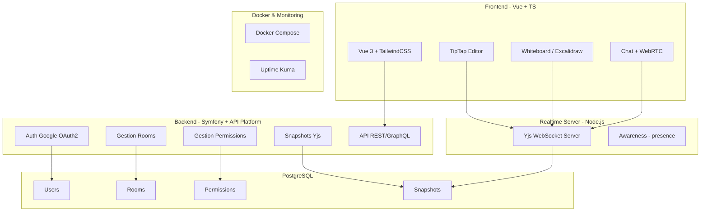

# 🚀 Synkro — Collaborative Platform  
_by Melwin & Kyllian_  

Synkro est une plateforme **collaborative temps réel** qui combine **édition de texte, whiteboard, chat, visioconférence et gestion fine des permissions**.  
Construit en **4 jours**, ce projet met l'accent sur la **fluidité**, la **simplicité d'usage** et une **expérience moderne**.  

---

## 🛠️ Tech Stack
- **Frontend** : Vue.js (TypeScript) + TailwindCSS + DaisyUI  
- **Backend** : Symfony + API Platform  
- **Realtime Server** : Node.js + Yjs (WebSocket)  
- **Database** : PostgreSQL  
- **Surveillance** : Uptime Kuma  
- **Infra** : Docker & Docker Compose  

---

## 🔑 Fonctionnalités principales
1. **Auth & Espace Client**  
   - Connexion/inscription via Google (OAuth2)  
   - Compte utilisateur avec espace dédié  

2. **Rooms collaboratives**  
   - Publiques (ouvertes à tous) ou privées (protégées par mot de passe)  
   - Liste des participants en temps réel (Yjs Awareness)  
   - Permissions granulaires : `editor`, `commenter`, `viewer`, `drawer`  

3. **Éditeur collaboratif (TipTap + Yjs)**  
   - Écriture partagée en temps réel  
   - Undo/Redo distribués  
   - Commentaires inline  

4. **Whiteboard intégré**  
   - Crayon, plume, gomme, couleurs, épaisseurs  
   - Mode post-its (brainstorm)  

5. **Chat & Réunions**  
   - Chat texte en direct  
   - Réunion audio/vidéo via WebRTC (lib type LiveKit)  

6. **Gestion Admin**  
   - Kick/exclure un membre (liste noire locale)  
   - Modifier les rôles/permissions  
   - Supprimer une room  

7. **Templates de rooms**  
   - `Brainstorm` → Whiteboard + post-its  
   - `Rédaction` → TipTap seul  
   - `Réunion` → Chat + WebRTC  

8. **Historique & Snapshots**  
   - Snapshots Yjs stockés en PostgreSQL (`jsonb`)  
   - Rollback possible  

9. **Notifications en temps réel**  
   - Invitation, kick, changement de rôle  
   - Toast notifications (DaisyUI)  

10. **Export / Import**  
   - Export en PDF / ODT  
   - Import d'éléments externes  

---

## 🏗️ Architecture

