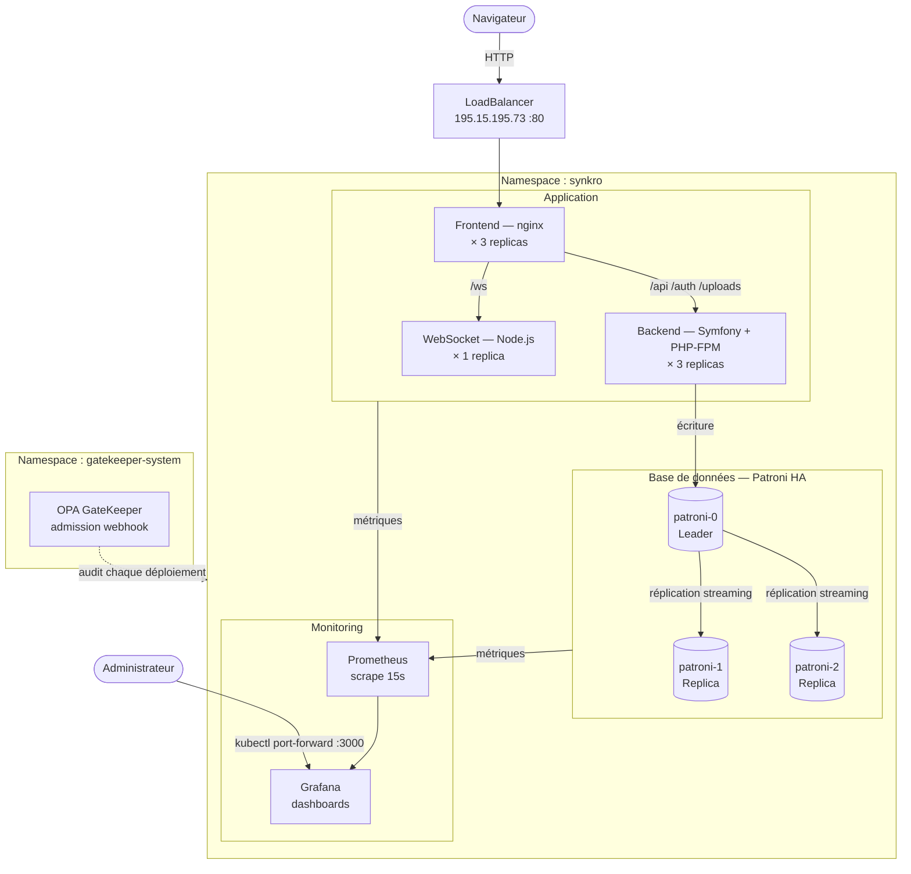
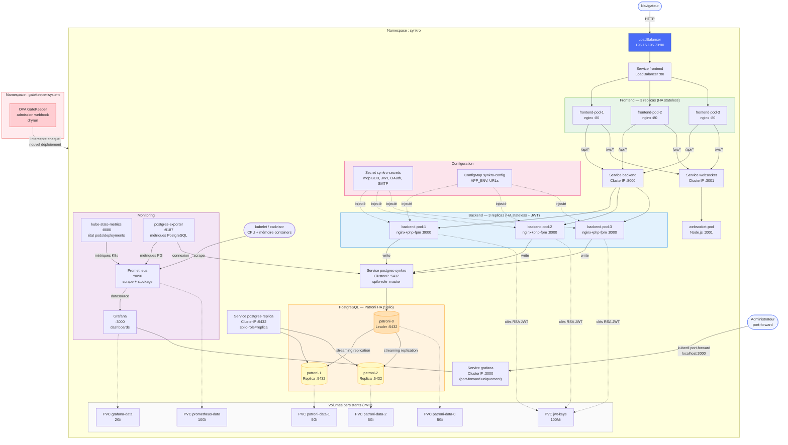

# Architecture Kubernetes — Synkro

## Vue simplifiée

---

## Vue complète

---

## Légende

| Symbole | Signification |
|---|---|
| `→` (flèche pleine) | Flux réseau actif (requêtes HTTP, scrape, réplication) |
| `-.->` (flèche pointillée) | Montage de volume ou injection de config |
| `Service ClusterIP` | Accessible uniquement en interne au cluster |
| `Service LoadBalancer` | Exposé sur une IP publique |
| `StatefulSet` | Pod avec identité stable et stockage persistant |
| `Deployment` | Pods stateless, scalables horizontalement |

## Ports clés

| Service | Port interne | Exposition externe |
|---|---|---|
| Frontend | 80 | `195.15.195.73:80` |
| Backend | 8000 | Non exposé (interne uniquement) |
| WebSocket | 3001 | Non exposé (via frontend) |
| PostgreSQL (Patroni leader) | 5432 | Non exposé |
| PostgreSQL (Patroni replicas) | 5432 | Non exposé |
| Prometheus | 9090 | Non exposé |
| Grafana | 3000 | `kubectl port-forward` localhost:3000 |
