# Guide opérationnel — Infrastructure Kubernetes Synkro

Ce guide explique comment fonctionne l'infrastructure, comment la déployer depuis zéro et comment l'utiliser au quotidien.

Pour les détails techniques de chaque ressource : [README.md](README.md)  
Pour le diagramme d'architecture : [ARCHITECTURE.md](ARCHITECTURE.md)

---

## 1. Vue d'ensemble

L'application Synkro tourne sur un cluster Kubernetes hébergé chez **Infomaniak**, dans le namespace `synkro`.

| Composant | Type | Replicas | Port exposé |
|---|---|---|---|
| Frontend (Vue 3 + nginx) | Deployment | 3 | `195.15.195.73:80` (public) |
| Backend (Symfony + PHP-FPM + nginx) | Deployment | 3 | Interne uniquement `:8000` |
| WebSocket (Node.js) | Deployment | 1 | Interne uniquement `:3001` |
| PostgreSQL (Patroni HA) | StatefulSet | 3 | Interne uniquement `:5432` |
| Prometheus | Deployment | 1 | Interne uniquement `:9090` |
| Grafana | Deployment | 1 | `localhost:3000` (port-forward) |

**Flux réseau simplifié :**
```
Navigateur → 195.15.195.73:80 → Frontend nginx
                                      ├── /api/*  → Backend nginx → PHP-FPM → PostgreSQL
                                      ├── /auth/* → Backend
                                      ├── /uploads/* → Backend
                                      └── /ws    → WebSocket (Node.js)
```

---

## 2. Prérequis & accès au cluster

### Le cluster Infomaniak

| Paramètre | Valeur |
|---|---|
| Cluster ID | `pck-neddugf` |
| Version Kubernetes | 1.35 (dernière version) |
| Data Center | Data Center 3 — Suisse |
| Groupe d'instances | `green-sheep` (`pck-neddugf-p3y`) |
| Type d'instance | `a4-ram8-disk50-perf1` (8 Go RAM, 50 Go disque) |
| Nœuds | 1 nœud worker |
| IP publique | `195.15.195.73` |

### Configurer kubectl

**1. Installer kubectl** (si pas encore fait) :
- Windows : `winget install Kubernetes.kubectl`
- Mac : `brew install kubectl`
- Linux : voir https://kubernetes.io/docs/tasks/tools/

**2. Télécharger le kubeconfig** depuis la console Infomaniak :
- Aller sur https://console.infomaniak.com → Kubernetes → cluster `pck-neddugf`
- Cliquer sur **"Télécharger"** à côté de *Kubeconfig*

**3. Placer et activer le fichier :**
```bash
mkdir -p ~/kube
mv ~/Downloads/pck-neddugf-kubeconfig ~/kube/
export KUBECONFIG=~/kube/pck-neddugf-kubeconfig
```

> Pour ne pas avoir à relancer l'export à chaque session, ajouter la ligne à `~/.bashrc` ou `~/.zshrc`.

**4. Tester la connexion :**
```bash
kubectl get nodes
# Résultat attendu : 1 nœud en état Ready
```

### Se placer dans le bon répertoire

Toutes les commandes `kubectl apply` ci-dessous sont à exécuter depuis la racine du projet :
```bash
cd /chemin/vers/synkro
```

---

## 3. Premier déploiement

L'ordre d'application est important : chaque étape dépend de la précédente.

### Étape 1 — Fondations

Namespace, secrets, configuration et volume JWT. Tout le reste en dépend.

```bash
kubectl apply -f k8s/namespace.yaml
kubectl apply -f k8s/secrets.yaml
kubectl apply -f k8s/configmap.yaml
kubectl apply -f k8s/jwt-pvc.yaml
```

### Étape 2 — Base de données PostgreSQL (Patroni HA)

PostgreSQL doit être prêt **avant** le backend, car le backend exécute les migrations SQL au démarrage.

```bash
kubectl apply -f k8s/postgres/patroni-rbac.yaml
kubectl apply -f k8s/postgres/patroni.yaml
```

Attendre ~60 secondes que `patroni-0` s'initialise et devienne leader, puis vérifier :

```bash
kubectl exec -n synkro patroni-0 -- bash -c "patronictl -c /run/postgres.yml list"
```

Résultat attendu (1 Leader, 2 Replica, Lag in MB = 0) :
```
+ Cluster: postgres-synkro ---+----+-----------+
| Member    | Host         | Role    | State     | TL | Lag in MB |
+-----------+--------------+---------+-----------+----+-----------+
| patroni-0 | 10.64.0.18   | Leader  | running   |  3 |           |
| patroni-1 | 10.64.0.115  | Replica | streaming |  3 |         0 |
| patroni-2 | 10.64.0.4    | Replica | streaming |  3 |         0 |
+-----------+--------------+---------+-----------+----+-----------+
```

### Étape 3 — Application

```bash
# Backend
kubectl apply -f k8s/backend-nginx-configmap.yaml
kubectl apply -f k8s/backend-deployment.yaml
kubectl apply -f k8s/backend-service.yaml

# Frontend
kubectl apply -f k8s/frontend-nginx-configmap.yaml
kubectl apply -f k8s/frontend-deployment.yaml
kubectl apply -f k8s/frontend-service.yaml

# WebSocket
kubectl apply -f k8s/websocket-deployment.yaml
kubectl apply -f k8s/websocket-service.yaml
```

Au premier démarrage, le backend peut prendre 1 à 2 minutes : les init containers génèrent les clés RSA JWT et exécutent les migrations avant que les pods ne passent en `Running`.

### Étape 4 — Sécurité GateKeeper OPA

GateKeeper intercepte chaque nouveau déploiement pour vérifier qu'il respecte les politiques de sécurité. Il faut attendre que ses CRDs soient enregistrés avant d'appliquer les contraintes.

```bash
kubectl apply -f k8s/gatekeeper/gatekeeper-install.yaml
sleep 30
kubectl apply -f k8s/gatekeeper/constraints.yaml
```

> Les contraintes sont en mode **`dryrun`** : les violations sont enregistrées mais rien n'est bloqué. Pour passer en mode bloquant : remplacer `enforcementAction: dryrun` par `enforcementAction: deny` dans `gatekeeper/constraints.yaml`.

### Étape 5 — Monitoring

```bash
kubectl apply -f k8s/monitoring/kube-state-metrics.yaml
kubectl apply -f k8s/monitoring/postgres-exporter.yaml
kubectl apply -f k8s/monitoring/prometheus.yaml
kubectl apply -f k8s/monitoring/grafana.yaml
kubectl apply -f k8s/monitoring/grafana-dashboard-configmap.yaml
```

---

## 4. Vérification post-déploiement

### Pods

```bash
kubectl get pods -n synkro
```

Résultat attendu — tous les pods en `Running`, 0 `RESTARTS` :
```
NAME                                    READY   STATUS    RESTARTS   AGE
backend-synkro-xxxxx                    2/2     Running   0          ...  (x3)
frontend-synkro-xxxxx                   1/1     Running   0          ...  (x3)
grafana-xxxxx                           1/1     Running   0          ...
kube-state-metrics-xxxxx               1/1     Running   0          ...
postgres-exporter-xxxxx                1/1     Running   0          ...
postgres-primary-0                      1/1     Running   0          ...
postgres-replica-0                      1/1     Running   0          ...
prometheus-xxxxx                        1/1     Running   0          ...
websocket-synkro-xxxxx                  1/1     Running   0          ...
```

### Services

```bash
kubectl get svc -n synkro
```

Résultat attendu :
```
NAME               TYPE           CLUSTER-IP       EXTERNAL-IP      PORT(S)
backend-synkro     ClusterIP      10.101.237.108   <none>           8000/TCP
frontend-synkro    LoadBalancer   10.104.209.246   195.15.195.73    80:xxxxx/TCP
postgres-synkro    ClusterIP      10.101.0.38      <none>           5432/TCP
websocket-synkro   ClusterIP      10.101.6.97      <none>           3001/TCP
```

### Patroni HA

```bash
kubectl exec -n synkro patroni-0 -- bash -c "patronictl -c /run/postgres.yml list"
# Vérifier : 1 Leader + 2 Replica, Lag = 0
```

### GateKeeper

```bash
kubectl get pods -n gatekeeper-system   # pods Running
kubectl get constraints -A              # liste les violations (non bloquant en dryrun)
```

---

## 5. Accès aux interfaces

### Application Synkro

Ouvrir directement dans le navigateur : **http://195.15.195.73**

### Grafana (monitoring)

Grafana n'est pas exposé publiquement. Utiliser un port-forward :

```bash
kubectl port-forward -n synkro svc/grafana 3000:3000
```

Puis ouvrir **http://localhost:3000** dans le navigateur.

Le dashboard **"Synkro — Vue d'ensemble"** est auto-provisionné. Il affiche :

| Section | Contenu |
|---|---|
| **État des services** | Frontend X/3, Backend X/3, WebSocket X/1, PostgreSQL X/1 — vert si tout est actif |
| **Charge du serveur** | CPU % des limites (~1% au repos), Mémoire % des limites (~10% au repos), redémarrages de pods, trafic réseau |
| **Ressources détaillées** | CPU et mémoire par service (courbes avec seuils jaune/rouge) |
| **PostgreSQL** | Transactions/s, taille de la base, lag de réplication |

---

## 6. Opérations courantes

### Voir les logs

```bash
# Logs du backend (PHP-FPM)
kubectl logs -n synkro -l app=backend-synkro -c backend-fpm --tail=100 -f

# Logs du frontend (nginx)
kubectl logs -n synkro -l app=frontend-synkro --tail=50

# Logs du WebSocket
kubectl logs -n synkro -l app=websocket-synkro --tail=100 -f

# Logs Patroni
kubectl logs -n synkro patroni-0 --tail=50
```

### Redémarrer un déploiement

```bash
kubectl rollout restart deployment/backend-synkro -n synkro
kubectl rollout restart deployment/frontend-synkro -n synkro
kubectl rollout restart deployment/websocket-synkro -n synkro
```

### Mettre à jour une image après `docker push`

```bash
# Exemple : mise à jour du frontend
kubectl rollout restart deployment/frontend-synkro -n synkro
kubectl rollout status deployment/frontend-synkro -n synkro
# Attendre "successfully rolled out"
```

### Tester le failover Patroni

Patroni garantit la haute disponibilité de PostgreSQL. Pour tester que le failover fonctionne :

```bash
# 1. Supprimer le pod leader
kubectl delete pod patroni-0 -n synkro

# 2. Attendre ~30s, puis vérifier qu'un replica a pris le relais
kubectl exec -n synkro patroni-1 -- bash -c "patronictl -c /run/postgres.yml list"
# patroni-1 (ou patroni-2) doit afficher Role=Leader

# 3. Patroni-0 redémarre automatiquement comme Replica
kubectl get pods -n synkro -w
```

### Mettre à jour les secrets

Les secrets sont stockés en base64 dans `k8s/secrets.yaml`. Pour mettre à jour :

```bash
# Encoder une nouvelle valeur
echo -n "nouvelle_valeur" | base64

# Modifier secrets.yaml, puis réappliquer
kubectl apply -f k8s/secrets.yaml

# Redémarrer les pods pour prendre en compte les nouveaux secrets
kubectl rollout restart deployment/backend-synkro -n synkro
```

### Reset complet (attention : données perdues)

```bash
kubectl delete namespace synkro
# Les PVC (données PostgreSQL, clés JWT) sont supprimés avec le namespace
# Pour garder les données : supprimer les ressources une par une plutôt que le namespace entier
```

---

## 7. Annexes — Preuves de fonctionnement

### Cluster Infomaniak

Cluster `pck-neddugf` actif sur le Data Center 3 (Suisse), Kubernetes 1.35, instance `a4-ram8-disk50-perf1`.

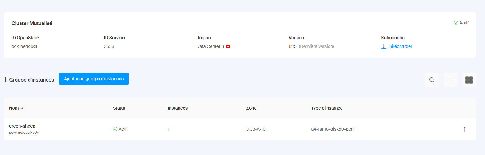

---

### Déploiement initial — pods Running

Premier déploiement réussi : backend (2/2), frontend (1/1), postgres et websocket tous en `Running`.

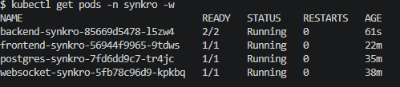

---

### LoadBalancer et IP publique

Le service `frontend-synkro` de type `LoadBalancer` a bien reçu l'IP publique `195.15.195.73`.


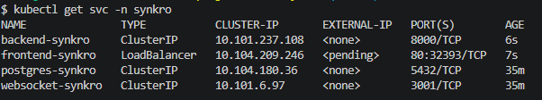

---

### Stack complète opérationnelle

Tous les pods Running après déploiement du monitoring : backend (3 replicas), frontend (3 replicas), websocket, postgres-primary, postgres-replica, grafana, kube-state-metrics, postgres-exporter, prometheus.

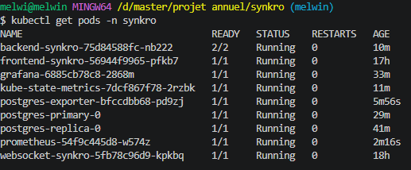

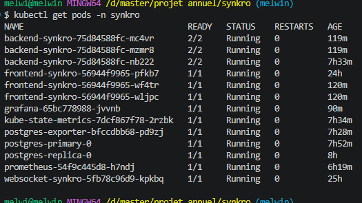

---

### Dashboard Grafana — Kubernetes

Dashboard K8S Grafana montrant 22 pods actifs, 19 workloads, 1 nœud — usage CPU 88% des limites demandées, réseau jusqu'à 27 Mb/s.

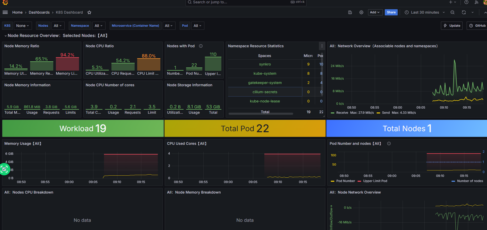

---

### Dashboard Grafana — PostgreSQL

Dashboard PostgreSQL montrant PostgreSQL 16.13 actif, ~664 Ko de fetch data, 9 transactions/s sur la base `synkro`, mémoire résidente ~610 Ko.

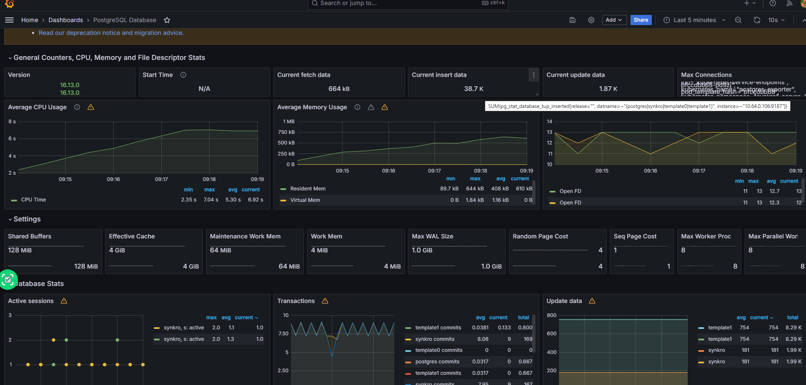

---

### Dashboard Grafana — Synkro Vue d'ensemble

Tous les services affichent **Actif** : Frontend 3/3, Backend 3/3, WebSocket 1/1, PostgreSQL 1/1. CPU à 1,12 % des limites, mémoire à 10,3 %, aucun redémarrage de pod.

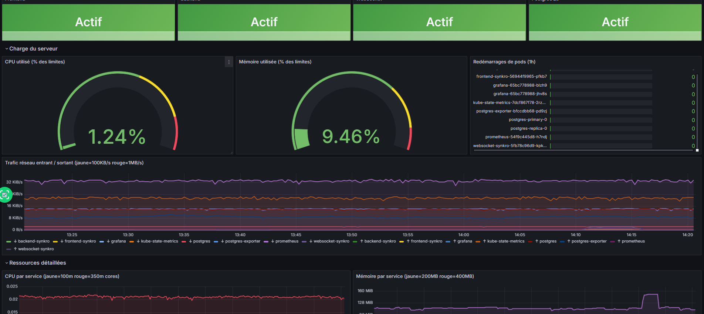

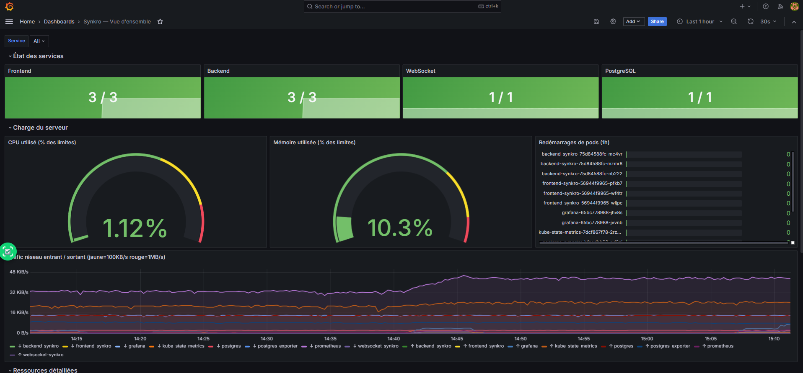

---

### Dashboard Grafana — Rollout en cours

Capture pendant un `kubectl rollout restart` : le backend affiche 2/3 (jaune) le temps que le troisième pod redémarre, puis repasse à 3/3 (vert). Cela prouve que le rolling update fonctionne sans interruption de service.

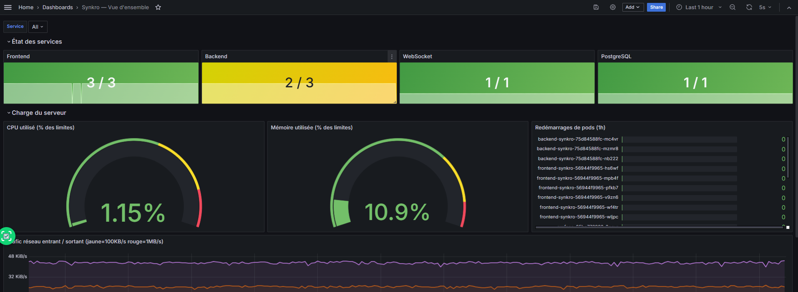

---

### Test de failover Patroni

**Simulation de panne** : suppression forcée de `patroni-0` (le leader). Pendant la bascule, `patroni-0` est `unknown` et `patroni-1` prend le rôle de Leader en ~30 secondes.

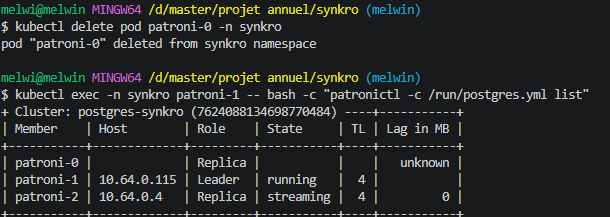

**Après recovery** : `patroni-0` a redémarré automatiquement et rejoint le cluster comme Replica. `patroni-0` reprend ensuite le rôle de Leader au redémarrage (timeline 3), les deux autres passent en Replica avec un lag de 0 Mo.

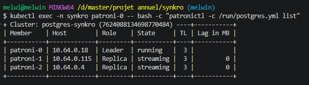
